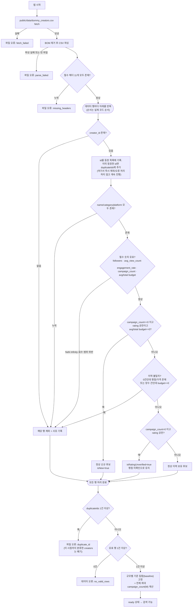
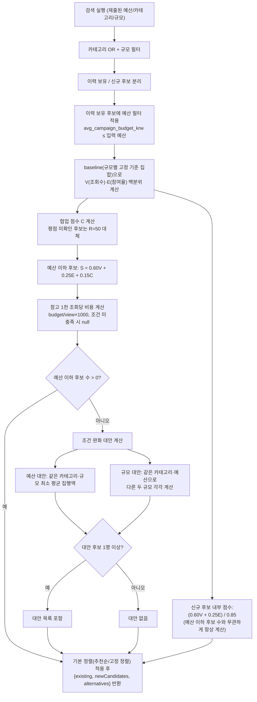
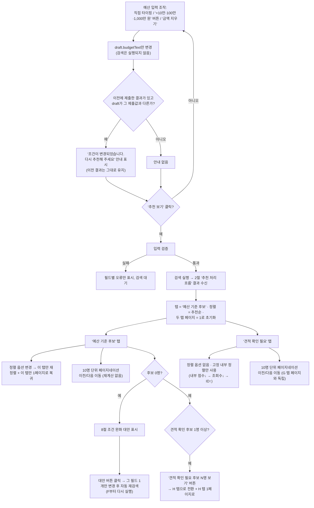

# 흐름도

`src/lib`의 실제 구현(`dataLoad.ts`, `filter.ts`, `scoring.ts`, `search.ts`, `alternatives.ts`, `sort.ts`, `pagination.ts`)과 UI(`App.tsx`, `SearchForm.tsx`, `BudgetInput.tsx`)의 분기를 반영한 Mermaid 흐름입니다. 계산/데이터 처리(1~2절)와 화면 조작(3절)을 분리해, 한 그림에 모든 분기를 넣지 않았습니다.

## 1. 데이터 로드 및 검증

중복 id 검사는 각 행을 처리하는 도중(이름/카테고리 검사보다 먼저) 집합에 기록되지만, 실제 `duplicate_id` 오류는 **모든 행을 다 처리한 뒤 한 번만** 던져집니다. 즉 한 행이라도 id가 중복되면 그 시점까지 분류해 둔 신규/이력 보유 후보 전체가 폐기되고 파일 오류로 처리됩니다.

## 2. 추천 처리 흐름

점수·필터·정렬·대안 계산 로직은 이번 화면 개편에서 변경되지 않았습니다. 이 흐름이 반환하는 `existing`/`newCandidates`/`alternatives`를 화면에서 어떻게 다루는지는 3절을 참고하세요.

## 3. UI 조작 흐름

핵심 포인트:

- 예산 입력의 직접 타이핑, 금액 추가(+10만/+100만/+1,000만 원), 금액 지우기는 모두 `draft` 상태만 바꿀 뿐 그 자체로 검색을 실행하지 않습니다. 검색은 오직 ‘추천 보기’ 클릭(C)에서만 실행됩니다.
- 기존 결과가 있는 상태에서 위 세 가지 방법 중 무엇으로 예산을 바꾸든 동일하게 ‘조건이 변경되었습니다’ 안내(B1)가 뜹니다.
- 정렬 컨트롤은 ‘예산 기준 후보’ 탭에만 있고(G1), ‘견적 확인 필요’ 탭(H)은 고정 정렬만 사용합니다.
- 새 검색·조건 완화 적용은 탭·정렬·양쪽 페이지를 모두 초기화하지만(F), 탭을 수동으로 전환하는 것 자체는 상대 탭의 페이지 번호를 건드리지 않습니다.
